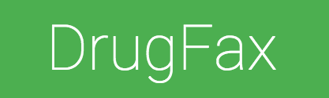
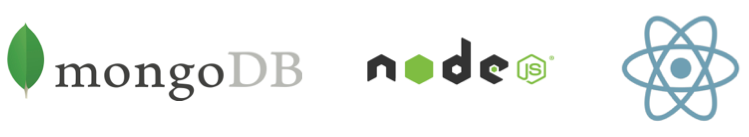
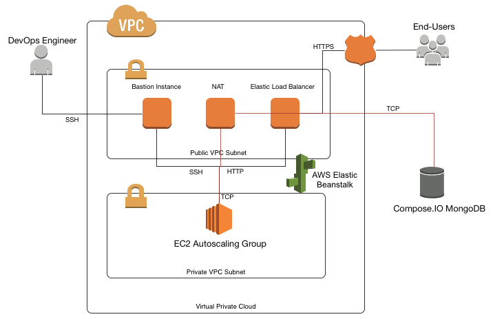
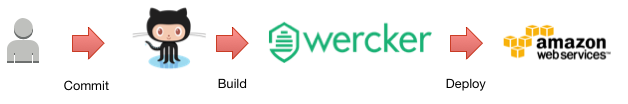
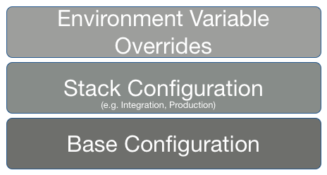

### ATS 18F Demo (Pool 2)

https://drugfax.atsid.net

**DrugFax** is the *CarFax for Drugs*, allowing consumers to understand the risks of their medication and the quality of drug manufacturers. 

### Key Features
* Users may search for drugs and view a detailed drug profile.
* Users may search for manufacturers and view their aggregate score, determined by the quantity of enforcement events associated with drugs that manufacturer produces.
* Users may save drugs that they are interested in. 
* Facebook and Twitter authentication.

_Note_: The letters in the headings below map to the Agile Delivery Services technical approach evaluation factors for Pool 2 submissions.

## Team (a. & b.)
 **[Chris Trevino](http://www.github.com/darthtrevino)** *Team Leader, Technical Architect*

 **[David Tittsworth](http://www.github.com/stopyoukid)** *Back-End Developer*

 **[Brian Mathews](http://ww.github.com/bmathews)** *Front-End Developer*

## Technology Stack (c.)

DrugFax has been written using a variety of open-source technologies. Including:
### Database
* [MongoDB](www.mongodb.org)
* [mongoose](http://mongoosejs.com/)
* [mongoose-organizer](https://www.npmjs.com/package/mongoose-organizer) (ATS Open Source)

### Server
* [NodeJS](https://nodejs.org/)
* [Express](expressjs.com/)
* [Passport](passportjs.org)
* [node-config](https://www.npmjs.com/package/config)
* [express-jefferson](https://www.npmjs.com/package/express-jefferson) (ATS Open Source)
* [express-mountie](https://www.npmjs.com/package/express-mountie) (ATS Open Source)

### Client
* [React](https://facebook.github.io/react/)
* [Browserify](http://browserify.org/)
* [chart.js](http://www.chartjs.org/)

### Development & Build System
* [gulp](http://gulpjs.com/)
* [nodemon](http://nodemon.io/)
* [Docker Compose](https://docs.docker.com/compose/)

### Testing
* [SuperAgent](https://github.com/visionmedia/superagent)
* [Mocha](http://mochajs.org/)
* [Chai](chaijs.com)
* [rewire](https://github.com/jhnns/rewire)
* [nock](https://github.com/pgte/nock)

## Infrastructure (d.)
DrugFax has been containerized using [Docker](https://www.docker.com/) and is hosted on [AWS Elastic Beanstalk](http://aws.amazon.com/elasticbeanstalk/), AWS' Platform-as-a-Service (PaaS) offering, using the Beanstalk/Docker template. 
The creation of necessary infrastructure has been automated by using [AWS CloudFormation](https://aws.amazon.com/cloudformation/). 
The CloudFormation document we used to generate the live infrastructure has been provided in [cloudformation.json](https://github.com/atsid/18f-RFQ993471-POOL2/blob/master/cloudformation.json).
The database instances for the application are hosted in [compose.io](http://compose.io/), which hosted management of MongoDB and other NoSQL databases.

## Testing (e.)
The entire application has been tested using [mocha](https://github.com/mochajs/mocha), [chai](http://chaijs.com/), and [SuperAgent](https://visionmedia.github.io/superagent/). 
The client-tests use [jsdom](https://github.com/tmpvar/jsdom) to emulate DOM interactions. 
Unit testing coverage has been reported to [CodeClimate](codeclimate.com), and metrics may be viewable at the CodeClimate badge link at the top of this file.

## Development / Continuous Integration Practices (f.)

We used the [Github Flow](https://guides.github.com/introduction/flow/) practice of encapsulating changes to the project as pull requests. 
This allows us to have a code review policy before code is merged into the master (stable) branch.  
We use [Wercker](wercker.com) as our Continuous Integration and Deployment (CI/CD) system to build the application. 
Successful Wercker builds are saved as new tagged version of the application in our Docker Hub account.
Wercker supports Github Flow and provides build information with every build on every branch, this allows us some level of verification before code is merged into the stable branch.
Wercker, CodeClimate, and Github all emit WebHook events into Slack, which we have utilized as our team communication mechanism.

## Configuration Management (g.)
We use [node-config](https://www.npmjs.com/package/config) to manage our application configuration. 
Node-Config allows you to define a default configuration object, and optional overrides per each NODE_ENV environment. 
Additionally, it provides a bridge for environment variables to be injected into the configuration object. 
We use environment variables exclusively to manage sensitive API keys and connection strings.

## Continuous Monitoring (h.)
DrugFax is monitored using [NewRelic](http://newrelic.com/). NewRelic provides performance and availability monitoring, and can alert us to critical events using a service integration with PagerDuty. If the NEWRELIC_LICENSE_KEY environment variable is set, the application will start up the NewRelic monitor.

## Containerization/Virtualization (i.)

As mentioned above, we package the DrugFax app as a Docker container, and use this to deploy to AWS' Elastic Beanstalk (although any other IaaS/Paas provider that supports Docker containers could be used). In the developer getting-started instructions below, we also provide a Vagrantfile that can be used to spin up a development instance for those who do not have native Docker support.

## Iterative approach (j.)

The GitHub Flow process allows us to receive feedback via peer reviews throughout the development process. We use GitHub Issues to track development progress, and use [HuBoard](https://huboard.com/) to provide a more user-friendly, Kanban-style user experience for prioritizing and updating progress. As mentioned, all of these tools are integrated with our Slack channel, where most internal feedback is captured and used to inform subsequent work.

## Development Instructions (k.)
### Installation
#### Using Docker Compose (Recommended for Linux)
    > docker-compose build && docker-compose up
        
#### Using Vagrant (Slower Startup)
    > vagrant plugin install vagrant-docker-compose
    > vagrant up
    
### Opening the Application
* **Linux or Vagrant**: `> open http://localhost:9000/`
* **OSX via Docker Compose**: `> open http://$(boot2docker ip 2>/dev/null):9000`

## License (l.)
[Apache 2.0](https://www.apache.org/licenses/LICENSE-2.0)

ATS ❤ Open Source
